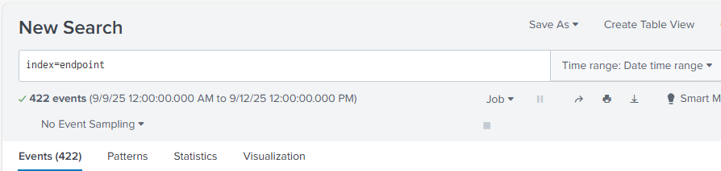
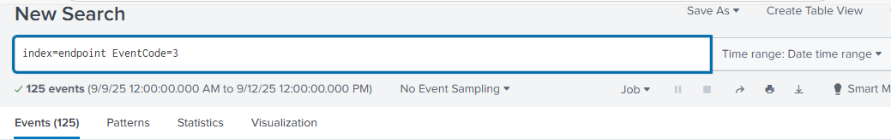
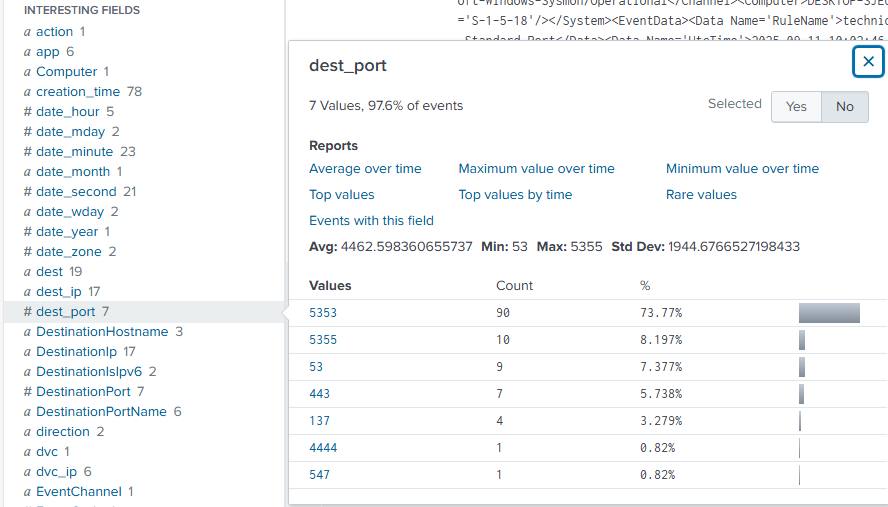
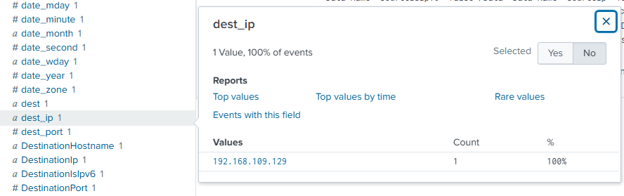
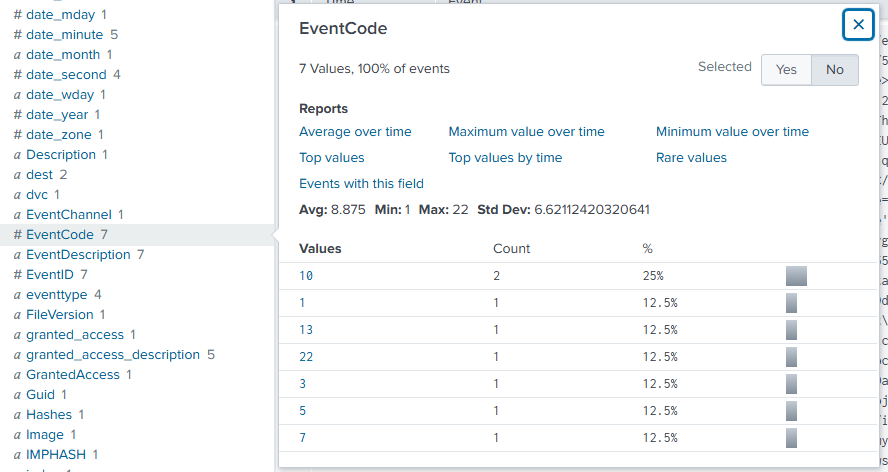
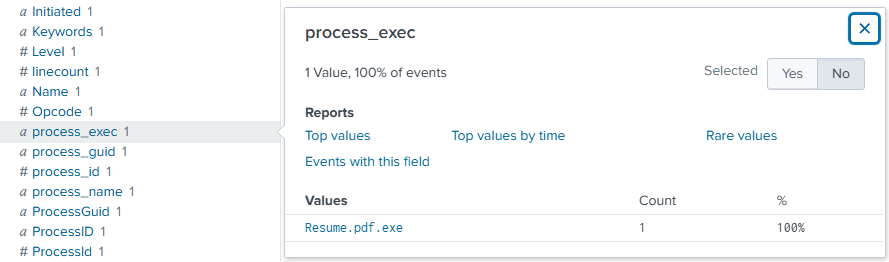
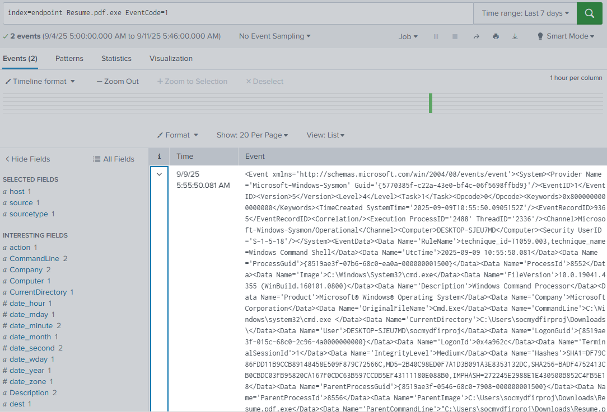
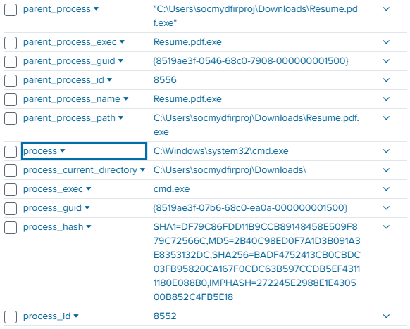
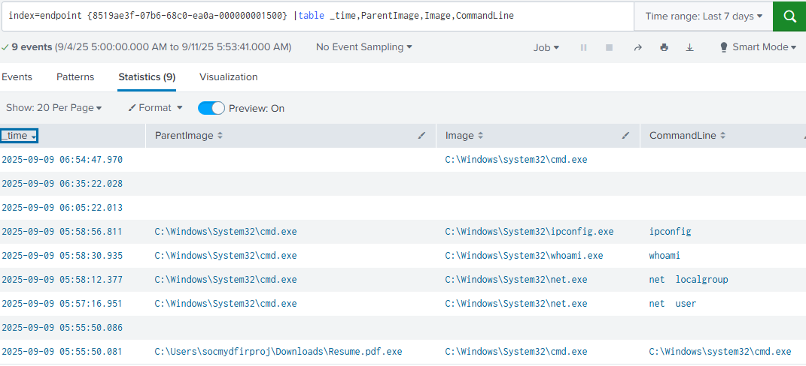

# 🛡️ Endpoint Detection Lab with Splunk & Sysmon

## Objective
The Endpoint Detection Lab project was designed to create a controlled environment for simulating and detecting malicious activity on a **Windows 10** endpoint. The primary focus was to collect telemetry with **Sysmon**, ingest and analyze logs within **Splunk Enterprise**, and generate test data through adversary emulation using **Metasploit**. This hands-on exercise provided practical experience in identifying reverse shell activity, investigating suspicious processes, and correlating events to reconstruct an attack timeline, strengthening core SOC analyst detection and investigation skills.

- Configure **Sysmon** on Windows 10 for endpoint telemetry
- Ingest logs into **Splunk Enterprise**
- Simulate a **reverse shell attack** from Kali Linux with Metasploit
- Detect suspicious network connections and child processes in Splunk
- Investigate the attack timeline using Sysmon + Splunk correlation

### Skills Learned

- Practical experience configuring Sysmon to generate endpoint telemetry.
- Proficiency in Splunk SPL for detecting suspicious processes, binaries, and network activity.
- Ability to correlate Sysmon events to trace attack paths and reconstruct timelines.
- Hands-on exposure to reverse shell detection through anomalous network traffic (TCP 4444).
- Improved understanding of parent-child process relationships in malware investigations.
- Experience with Metasploit (msfvenom + multi/handler) for adversary emulation.
- Application of incident investigation workflows (discovery → analysis → findings → reporting).
- Strengthened SOC analyst skills including log analysis, threat detection, and root cause analysis.

### Tools Used

- Splunk Enterprise – SIEM platform for log ingestion, correlation, and detection queries.
- Sysmon (Sysinternals) – Endpoint telemetry tool for capturing process and network events.
- Metasploit Framework (msfvenom & multi/handler) – Payload generation and reverse shell exploitation.
- Python HTTP Server – Used to host and deliver the malicious payload.
- VMware Workstation – Virtualization platform for isolated attacker and victim environments.
- Windows 10 – Endpoint target for Sysmon telemetry and reverse shell execution.
- Kali Linux – Attacker system for reconnaissance, payload hosting, and exploitation.

## 🏗️ Lab Architecture


*Ref 1: Network Diagram*

## ⚙️ Setup & Configuration

### Windows 10 VM
- Installed **Sysmon** with modular configuration
- Installed **Splunk Enterprise**
- Configured `inputs.conf` to send Sysmon logs to `index=endpoint`
- Restarted **Splunkd service**

### Splunk
- Created a new index: endpoint
- Installed Splunk Add-on for Sysmon
- Verified Sysmon logs ingestion

## 🚨 Attack Simulation (Red Team)
1. **Recon**: Scanned victim with Nmap from Kali
2. **Payload**: Generated reverse TCP payload (Resume.pdf.exe) with Metasploit
3. **Delivery**: Hosted payload on Kali with Python HTTP server (python3 -m http.server 9999)
4. **Execution**: Downloaded + executed payload on Windows 10
5. **Exploitation**: Reverse shell established back to Kali (Meterpreter session)
6. **Post-Exploitation**: Enumerated users, groups, and network info


*Ref 2: Screenshot showing the configuration of Metasploit’s multi/handler module. The reverse TCP payload was set with LHOST (192.168.109.129) and LPORT (4444) to receive a reverse shell from the victim.*


*Ref 3: Screenshot showing the Metasploit multi/handler receiving a connection from the Windows 10 victim. The successful Meterpreter session confirms the reverse shell was established on TCP port 4444.*

---

## 🔍 Detection in Splunk (Blue Team)



*Ref 4: Screenshot showing the initial Splunk query (index=endpoint) confirming that Sysmon logs were successfully ingested, with 422 events available for investigation.*

### 1. Broad Search - Reviewing Network Connections
Started with a broad search for all Sysmon EventCode 3 (Network Connections):
```spl
index=endpoint EventCode=3
```


*Ref 5: Screenshot showing a Splunk query for Sysmon EventCode 3 (Network Connections). This broad search returned 125 events and served as the foundation for identifying the reverse shell connection on TCP port 4444.*

---



*Ref 6: Screenshot of Splunk field analysis for dest_port. Most traffic used expected system ports (5353, 5355, 443), but a rare connection on port 4444 was identified — the reverse shell session created by the malicious payload.*

---

### 2. Suspicious Network Connection (Discovery)
Refined the search to identify traffic to the attacker’s IP and port:

```spl
index=endpoint EventCode=3 dest_ip=192.168.117.130 dest_port=4444 
```



*Ref 7: Screenshot showing Splunk query results confirming outbound traffic from the victim to the attacker’s IP (192.168.117.130) on TCP port 4444. This connection corresponds to the reverse shell established by the malicious payload.*

---

Once can pin point the odd traffic we then can refine our search using `EventCode` this time using EventCode 1.



*Ref 8: Screenshot showing Splunk field analysis of Sysmon EventCodes. By pivoting from EventCode 3 (network connections) to EventCode 1 (process creation), analysts can identify the binary (Resume.pdf.exe) responsible for initiating the reverse shell.*

---

### 3. Malicious Binary Execution (Root Cause Analysis)

Pivoted to Event Code 1 (Process Creation) we spot a suspicious process `Resume.pdf.exe` 



*Ref 9: Screenshot showing Splunk query results for Sysmon EventCode 1. The malicious process Resume.pdf.exe was identified as the binary responsible for initiating the reverse shell connection.*

---

### 4. Suspicious Child Processes (Process Tree Investigation)
Investigated the process tree to confirm parent/child relationships:
```spl
index=endpoint Resume.pdf.exe EventCode=1
```


*Ref 10: Screenshot showing Splunk process tree analysis. The malicious binary Resume.pdf.exe spawned cmd.exe, confirming suspicious child process activity leading to the reverse shell (Expand the data to gain more information).*



Confirmed Resume.pdf.exe spawned cmd.exe, which later invoked PowerShell for payload execution.

---

### 5. Timeline of Attack (Correlating Activity by GUID)
Reconstructed the full attack chain using process GUID:
```spl
index=endpoint {8519ae3f-07b6-68c0-ea0a-000000001500}
| table _time,ParentImage,Image,CommandLine
```


---
 
## 📑 Findings
- Reverse shell established from victim → attacker on TCP/4444
- Malicious binary `Resume.pdf.exe` was executed from the Downloads folder
- Sysmon Event ID 1 (Process Creation) confirmed it spawned `cmd.exe` and `powershell.exe`
- Sysmon Event ID 3 (Network Connection) confirmed outbound traffic to attacker IP
- Attack chain: `Resume.pdf.exe → cmd.exe → powershell.exe → reverse shell`

## ✅ Conclusion
This lab demonstrates a full SOC workflow:
1️⃣ Detecting anomalous network activity (reverse shell on TCP 4444)
2️⃣ Pivoting into endpoint process telemetry to identify the root cause
3️⃣ Mapping the attack chain through parent/child process correlation
4️⃣ Reconstructing the timeline of adversary behavior

📈 Skills Demonstrated:

- Endpoint monitoring with Sysmon
- SIEM analysis with Splunk SPL queries
- Threat emulation with Metasploit
- Incident investigation & reporting

## 📂 Repository Structure
```perl
splunk-sysmon-reverse-shell-detection/
│── README.md             # Project landing page
│── lab_setup.md          # Setup instructions
│── attack_simulation.md  # Adversary steps
│── detection_queries.md  # Splunk SPL queries
│── screenshots/          # Evidence
│── report.pdf            # Professional write-up
```
## 🔗 References
- [Sysmon (Sysinternals)](https://learn.microsoft.com/en-us/sysinternals/downloads/sysmon)
- [Splunk Enterprise](https://www.splunk.com/en_us/download/splunk-enterprise.html)
- [Metasploit Framework](https://www.metasploit.com/)
- [Olaf Hartong Sysmon Modular Config](https://github.com/olafhartong/sysmon-modular)
