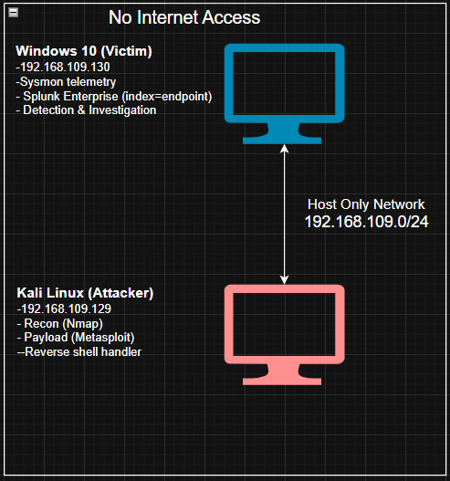
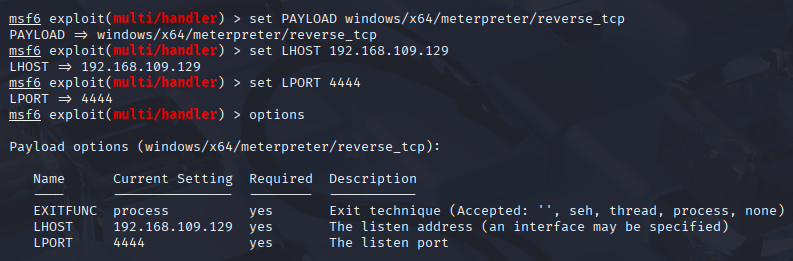
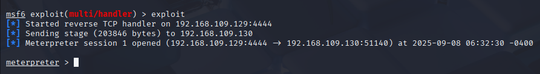

# 🛡️ Endpoint Detection Lab with Splunk & Sysmon

## 📖 Overview
This project demonstrates detecting malicious endpoint activity with **Sysmon** and **Splunk** in a VMware lab.  
A reverse shell attack was simulated from Kali Linux against a Windows 10 VM. Sysmon telemetry was ingested into Splunk and analyzed to trace the attack.

---

## 🎯 Objectives
- Configure **Sysmon** on Windows 10 for endpoint telemetry
- Ingest logs into **Splunk Enterprise**
- Simulate a **reverse shell attack** from Kali Linux with Metasploit
- Detect suspicious network connections and child processes in Splunk
- Investigate the attack timeline using Sysmon + Splunk correlation

---

## 🏗️ Lab Architecture



## ⚙️ Setup & Configuration

### Windows 10 VM
- Installed Sysmon with modular configuration
- Installed Splunk Enterprise
- Configured `inputs.conf` to send Sysmon logs to `index=endpoint`
- Restarted splunkd service

### Splunk
- Created a new index: endpoint
- Installed Splunk Add-on for Sysmon
- Verified Sysmon logs ingestion

## 🚨 Attack Simulation
1. Recon: Scanned victim with Nmap from Kali
2. Payload: Generated reverse TCP payload (Resume.pdf.exe) with Metasploit
3. Delivery: Hosted payload on Kali with Python HTTP server (python3 -m http.server 9999)
4. Execution: Downloaded + executed payload on Windows 10
5. Exploitation: Reverse shell established back to Kali (Meterpreter session)
6. Post-Exploitation: Enumerated users, groups, and network info



---



## 🔍 Detection in Splunk (Blue Team)


### 1. Broad Search - Reviewing Network Connections
Started with a broad search for all Sysmon EventCode 3 (Network Connections):
```spl
index=endpoint EventCode=3
```

### 1. Suspec Network Connection
```spl
index=endpoint EventCode=3 dest_ip=192.168.117.130 dest_port=4444 
```


### 2. Malicious Binary Execution (Root Cause Analysis)
```spl
index=endpoint Resume.pdf.exe
```


### 3. Suspicious Child Processes (Process Tree Investigation)
```spl
index=endpoint EventCode=1 ParentImage="*Resume.pdf.exe" Image="*cmd.exe"
```


4. Timeline of Attack (Correlating Activity by GUID)
```spl
index=endpoint {8519ae3f-07b6-68c0-ea0a-000000001500}
| table _time, ParentImage, Image, CommandLine
```


---

### 8. **Findings & Results**
 
## 📑 Findings
- Reverse shell established from victim → attacker on TCP/4444
- `Resume.pdf.exe` spawned `cmd.exe` (suspicious child process)
- Correlated Sysmon Event IDs 1 (process creation) + 3 (network connection)
- Attack chain mapped: Resume.pdf.exe → cmd.exe → powershell.exe → reverse shell

## ✅ Conclusion
This lab demonstrates how endpoint telemetry and SIEM analysis can be used to detect and investigate adversary activity.  
It highlights essential SOC analyst skills:
- Endpoint monitoring (Sysmon)  
- Log analysis & correlation (Splunk)  
- Threat emulation (Metasploit)  
- Incident investigation workflows  

## 📂 Repository Structure
splunk-sysmon-reverse-shell-detection/
│── README.md             # Project landing page
│── lab_setup.md          # Setup instructions
│── attack_simulation.md  # Adversary steps
│── detection_queries.md  # Splunk SPL queries
│── screenshots/          # Evidence
│── report.pdf            # Professional write-up

## 🔗 References
- [Sysmon (Sysinternals)](https://learn.microsoft.com/en-us/sysinternals/downloads/sysmon)
- [Splunk Enterprise](https://www.splunk.com/en_us/download/splunk-enterprise.html)
- [Metasploit Framework](https://www.metasploit.com/)
- [Olaf Hartong Sysmon Modular Config](https://github.com/olafhartong/sysmon-modular)
